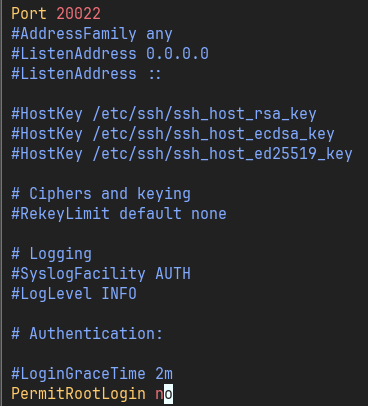
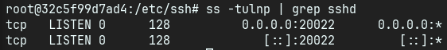
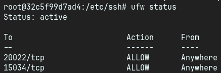
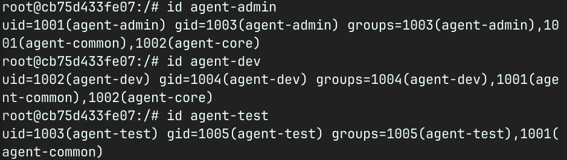
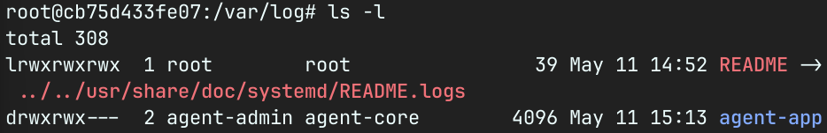
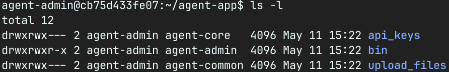

# 시스템 보안 및 모니터링 (B1-1)
## 1단계: 인프라 기본 보안 및 네트워크 통제

```
요구사항 1-1: SSH 기본 포트(22)를 20022로 변경 [o]

요구사항 1-2: Root 계정의 원격 접속(PermitRootLogin)을 차단 [o]

요구사항 1-3: 방화벽(UFW 또는 firewalld)을 활성화하고, 인바운드 정책은 기본 차단(Deny)으로 설정 [o]

요구사항 1-4: 방화벽에서 관리용 포트(TCP 20022)와 서비스용 포트(TCP 15034)만 예외적으로 허용 [o]
```
### Docker 기반으로 우분투 실행 및 초기 설정
- `docker run -itd --privileged --name [컨테이너이름] [이미지이름] bash` B1_ubuntu 라는 이름으로 컨테이너 생성 및 실행
    - --privileged 옵션 통해 커널 기능 활성화
    - systemctl 기능 사용하기 위함

- `apt-get update`, `apt install openssh-server`, `apt install vim`, `apt install iproute2`, `apt install ufw`, `apt install cron`업데이트 및 다운로드
- /etc/ssh/sshd_Config 파일 수정
    - 
    - #Port 22 -> Port 20022로 수정
    - #PermitRootLogin -> PermitRootLogin no 로 수정
    - `service ssh restart`로 ssh 재시작

    - 
    - 기본포트 20022에서 대기중임을 확인함.

- ufw 방화벽 활성화 및 포트 허용
    - `ufw default deny incoming` : 모든 연결 거부
    - `ufw allow 20022/tcp`, `ufw allow 15034/tcp` : 20022, 15034 포트만 허용
    - `ufw enable` : 방화벽 활성화
    - 
    - 방화벽 활성화 및 특정 포트 허용 확인
----


## 2단계: 역할 기반 계정 및 그룹 체계 구성 (IAM)
```
요구사항 2-1: 목적에 맞게 3개의 일반 사용자 계정(agent-admin, agent-dev, agent-test)을 생성[o]

요구사항 2-2: 권한 분리를 위해 2개의 그룹(agent-common, agent-core)을 생성[o]

요구사항 2-3: 각 계정의 역할에 맞게 그룹을 할당할 것 (예: agent-admin과 dev는 core 그룹 포함, test는 제외 등) [o]
```
- `groupadd agent-common`, `groupadd agent-core` : 그룹 생성
- `useradd -m -s /bin/bash -G agent-common,agent-core agent-admin` : 관리 계정 생성
- `useradd -m -s /bin/bash -G agent-common,agent-core agent-dev` : 개발 계정 생성
- `useradd -m -s /bin/bash -G agent-common agent-test` : test 계정 생성

- 
----
## 3단계: 디렉토리 구조 생성 및 최소 권한(ACL) 부여 (File System)

```
요구사항 3-1: AGENT_HOME 경로 아래에 목적별 디렉토리(upload_files, api_keys, bin) 및 로그 디렉토리(/var/log/agent-app)를 생성 [o]

요구사항 3-2: 공용 디렉토리(upload_files)는 agent-common 그룹에 R/W 권한을 부여 [o]

요구사항 3-3: 보안 디렉토리(api_keys) 및 로그 디렉토리는 핵심 인력인 agent-core 그룹에만 R/W 권한(770)을 부여하여 타 사용자의 접근을 원천 차단 [o]
```
- bash 명령어
```bash
    mkdir -p /var/log/agent-app # dir 생성
    chown agent-admin:agent-core /var/log/agent-app # 해당 dir 소유자 및 그룹 변경
    chmod 770 /var/log/agent-app # 해당 dir 권한 변경

# agent-admin 관련 dir에 core group이 접근 가능하게 함
    chgrp agent-core /home/agent-admin
    chmod 770 /home/agent-admin
    chgrp agent-core /home/agent-admin/agent-app 
    chmod 770 /home/agent-admin/agent-app
    chown agent-admin:agent-core /home/agent-admin/agent-app/bin
```
- 
    - 소유자 그룹및 권한 변경 완료
```bash
    su - agent-admin # 운영자 계정으로 전환

    export AGENT_HOME="/home/agent-admin/agent-app"
    mkdir -p $AGENT_HOME/upload_files $AGENT_HOME/api_keys $AGENT_HOME/bin # dir 생성

    # 본인이 속한 그룹으로 소유 그룹 변경 
    chgrp agent-common $AGENT_HOME/upload_files
    chgrp agent-core $AGENT_HOME/api_keys
    
    # 디렉토리 권한 설정 (소유자 및 그룹은 R/W/X 가능, 나머지는 접근 불가)
    chmod 770 $AGENT_HOME/upload_files
    chmod 770 $AGENT_HOME/api_keys

```
- 

## 4단계: 애플리케이션 환경 및 보안 키 구성 (App Environment)

```
요구사항 4-1: 지정된 경로에 인증용 API 키 파일(t_secret.key)을 생성하고 텍스트를 입력 [o]

요구사항 4-2: 키 파일의 권한을 640으로 설정하여 운영/개발자만 읽을 수 있도록 보호 [o]

요구사항 4-3: 애플리케이션 구동에 필요한 5가지 환경 변수(AGENT_HOME, AGENT_PORT, AGENT_UPLOAD_DIR, AGENT_KEY_PATH, AGENT_LOG_DIR)를 운영자(agent-admin) 계정에 설정 [o]
```

```bash
    # 키 파일 생성 (640: 소유자 R/W, 그룹 R, 그 외 불가)
    echo "agent_api_key_test" > $AGENT_HOME/api_keys/t_secret.key
    chmod 640 $AGENT_HOME/api_keys/t_secret.key

    # 환경변수 등록
    echo 'export AGENT_HOME="/home/agent-admin/agent-app"' >> ~/.bashrc # agent 앱이 설치된 기본 dir 경로 지정, ~/.bashrc 파일에 추가하여 로그인 시 자동 로드
    echo 'export AGENT_PORT="15034"' >> ~/.bashrc
    echo 'export AGENT_UPLOAD_DIR="$AGENT_HOME/upload_files"' >> ~/.bashrc
    echo 'export AGENT_KEY_PATH="$AGENT_HOME/api_keys/t_secret.key"' >> ~/.bashrc
    echo 'export AGENT_LOG_DIR="/var/log/agent-app"' >> ~/.bashrc
    source ~/.bashrc # bashrc 파일에 변경사항 즉시 반영
```

## 5단계: 시스템 관제 스크립트 구현 (Monitoring Automation)

```
요구사항 6-1: Bash 쉘 스크립트(monitor.sh)를 작성하여 앱 프로세스 생존 여부 및 포트(15034) 상태를 체크할 것 (실패 시 exit 1 처리). []

요구사항 6-2: CPU, 메모리, 디스크 사용률을 실시간으로 수집하고, 방화벽 활성화 상태를 점검할 것. []

요구사항 6-3: 자원 사용량이 임계값(CPU 20%, MEM 10%, DISK 80%)을 초과하거나 방화벽이 꺼져있을 경우 [WARNING] 문구를 출력하도록 구현할 것. []

요구사항 6-4: 스크립트 작성은 개발자(agent-dev)가, 실행 권한(750)은 그룹(agent-core)에 맞게 설정하여 무단 수정을 방지할 것. []
```

## 6단계: 주기적 모니터링 적용 및 로그 라이프사이클 관리 (Scheduling & Rotation)

```
요구사항 7-1: 운영자(agent-admin)의 crontab을 활용하여 작성한 관제 스크립트가 매 1분마다 자동 실행되도록 등록할 것. 

요구사항 7-2: 모니터링 결과가 지정된 포맷([시간] PID CPU MEM DISK)에 맞춰 monitor.log 파일에 지속적으로 누적되는지 검증할 것.

요구사항 7-3: 디스크 풀(Disk Full) 장애를 방지하기 위해, 로그 파일이 일정 용량(10MB)을 초과하면 백업 분리하고 최대 10개까지만 보관하는 Log Rotation 로직을 적용할 것.
```

```bash
    su - agent-dev # 개발자 계정으로 전환
    
    # 스크립트 파일 생성 (코드는 아래 2장 참조)
    touch /home/agent-admin/agent-app/bin/monitor.sh
    
    # 소유 그룹을 core로 변경 및 권한(750) 부여
    chgrp agent-core /home/agent-admin/agent-app/bin/monitor.sh
    chmod 750 /home/agent-admin/agent-app/bin/monitor.sh
```
> **[이해하기] 750 권한(rwxr-x---)의 이유**
> 소유자인 `agent-dev`는 수정(w)이 가능하고, 실행 계정인 `agent-admin`은 `agent-core` 그룹에 속해 있으므로 읽기(r)와 실행(x)만 가능하게 통제합니다. 이를 통해 **운영자가 코드를 무단 수정하는 것을 방지**합니다.


```bash
    su - agent-admin # 다시 운영자 계정으로 전환
    crontab -e
    
    # 파일 하단에 아래 내용 추가 (매 1분마다 실행)
    * * * * * /home/agent-admin/agent-app/bin/monitor.sh >> /dev/null 2>&1
```
> **[이해하기] cron이란?**
> 리눅스의 예약 작업 관리자입니다. `* * * * *`는 `분 시 일 월 요일`을 의미하며, 모두 `*`일 경우 **매 1분마다 무조건 실행하라**는 뜻입니다. 이렇게 하면 사람이 일일이 시스템을 들여다보지 않아도 스크립트가 알아서 상태를 체크하고 로그를 남겨줍니다.


```bash
#!/bin/bash

# ==========================================
# 시스템 상태 수집 및 로깅 스크립트
# ==========================================

# 기본 환경 변수 설정
APP_NAME="agent-app"
PORT=15034
LOG_DIR="/var/log/agent-app"
LOG_FILE="$LOG_DIR/monitor.log"
MAX_LOG_SIZE=10485760 # 10MB 한도 설정
MAX_LOG_FILES=10
DATE_NOW=$(date +"%Y-%m-%d %H:%M:%S")

echo "====== SYSTEM MONITOR RESULT ======"
echo "[HEALTH CHECK]"

# 1. 프로세스 상태 점검
# pgrep 명령어: 프로세스 목록에서 이름(APP_NAME)을 검색해 프로세스 ID(PID)를 반환합니다.
APP_PID=$(pgrep -f "$APP_NAME" | head -n 1)

if [ -z "$APP_PID" ]; then # PID가 비어있다면(-z) 앱이 죽은 것입니다.
    echo "Checking process '$APP_NAME'... [FAILED]"
    exit 1 # 비정상 상태이므로 스크립트 즉시 종료
else
    echo "Checking process '$APP_NAME'... [OK] (PID: $APP_PID)"
fi

# 2. 포트 LISTEN 상태 점검
# ss -tuln: 현재 서버에서 열려있는 TCP/UDP 포트 목록을 보여줍니다.
if ! ss -tuln | grep -q ":$PORT\b"; then
    echo "Checking port $PORT... [FAILED]"
    exit 1
else
    echo "Checking port $PORT... [OK]"
fi

# 3. 방화벽(UFW) 상태 점검
# systemctl is-active를 통해 서비스가 돌아가고 있는지 확인합니다.
if sudo ufw status 2>/dev/null | grep -qw "active"; then
    echo "Checking firewall (UFW)... [OK]"
else
    echo "[WARNING] 방화벽(UFW)이 꺼져 있습니다."
fi
# 4. 시스템 리소스 수집
echo -e "\n[RESOURCE MONITORING]"

# CPU 사용률: vmstat 명령어에서 유휴(idle) 비율을 가져와 100에서 빼줍니다.
# vmstat 1 2 : 1초 간격으로 2번 측정해서 cpu 상태 보여줌
# tail을 통해 출력 결과물 중 마지막 (실시간 측정 데이터만 출력)
# awk '{print $15}'를 통해 15번째 칸의 데이터 뽑아옴 == CPU의 idle 상태 비율
CPU_IDLE=$(vmstat 1 2 | tail -1 | awk '{print $15}')
CPU_USAGE=$((100 - CPU_IDLE))

# 메모리 사용률: free 명령어 결과에서 전체(Total) 대비 사용량(Used)의 비율을 계산합니다.
# grep Mem, : mem으로 시작하는 줄 걸러냄
# 2번째 칸은 전체 메모리, 3번째 칸은 사용중 메모리 의미
MEM_USAGE=$(free | grep Mem | awk '{printf("%.1f", $3/$2 * 100)}')

# 디스크 사용률: df 명령어에서 최상위 루트(/) 경로의 사용 퍼센트를 가져옵니다.
DISK_USED=$(df -h / | awk 'NR==2 {print $5}' | sed 's/%//')

echo "CPU Usage : ${CPU_USAGE}%"
echo "MEM Usage : ${MEM_USAGE}%"
echo "DISK Used : ${DISK_USED}%"

# 5. 리소스 임계값 초과 경고 (Bash는 소수점 계산이 어려워 awk를 활용)
if awk "BEGIN {exit !($CPU_USAGE > 20)}"; then
    echo "[WARNING] CPU 사용률이 20%를 초과했습니다."
fi

if awk "BEGIN {exit !($MEM_USAGE > 10)}"; then
    echo "[WARNING] 메모리 사용률이 10%를 초과했습니다."
fi

if [ "$DISK_USED" -gt 80 ]; then
    echo "[WARNING] 디스크 사용률이 80%를 초과했습니다."
fi

# 6. 로그 기록 (모니터링 이력 남기기)
if [ ! -f "$LOG_FILE" ]; then
    touch "$LOG_FILE"
    chmod 660 "$LOG_FILE"
fi

# 지정된 포맷으로 변수를 조합하여 로그 파일 끝에 추가(>>)합니다.
LOG_ENTRY="[$DATE_NOW] PID:$APP_PID CPU:${CPU_USAGE}% MEM:${MEM_USAGE}% DISK_USED:${DISK_USED}%"
echo "$LOG_ENTRY" >> "$LOG_FILE"

# 7. 로그 파일 용량 관리 (Log Rotation 기능 직접 구현)
# 로그 파일이 무한정 커져서 서버 디스크를 꽉 채우는 '디스크 풀(Disk Full)' 장애를 방지합니다.
FILE_SIZE=$(stat -c%s "$LOG_FILE" 2>/dev/null || echo 0)

if [ "$FILE_SIZE" -ge "$MAX_LOG_SIZE" ]; then
    TIMESTAMP=$(date +"%Y%m%d%H%M%S")
    mv "$LOG_FILE" "$LOG_FILE.$TIMESTAMP" # 기존 파일을 다른 이름으로 백업
    
    # 새 빈 로그 파일 생성
    touch "$LOG_FILE"
    chmod 660 "$LOG_FILE"
    
    # ls -t(시간 역순 정렬)로 최신 10개만 남기고 오래된 백업 파일은 삭제합니다.
    ls -tp "$LOG_DIR"/monitor.log.* 2>/dev/null | grep -v '/$' | tail -n +$((MAX_LOG_FILES + 1)) | xargs -d '\n' -r rm --
fi

```


## 7단계: 서비스 구동 및 정상 동작 검증 (Service Execution)

```
요구사항 5-1: 반드시 일반 계정(agent-admin)으로 애플리케이션을 실행할 것 []

요구사항 5-2: 앱 실행 시 출력되는 'Boot Sequence 5단계'가 모두 [OK]로 통과되는지 확인 []

요구사항 5-3: 최종적으로 Agent READY 메시지가 출력되며, 15034 포트가 LISTEN 상태가 되는지 점검 []
```


